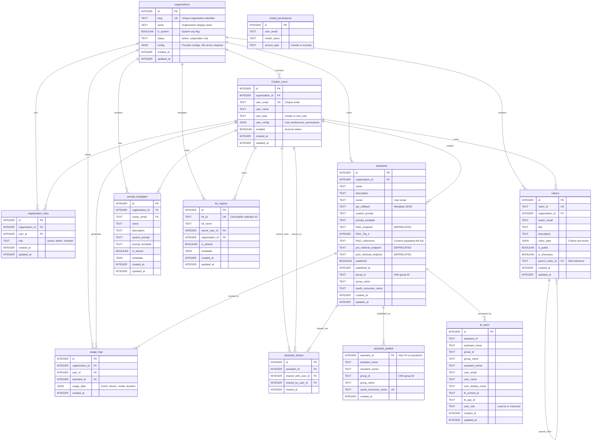

# LAMB Database Entity-Relationship Diagram

**Database:** LAMB Database (`lamb_v4.db`)  
**Type:** SQLite  
**Last Updated:** November 2025

---

## Overview

This diagram shows all tables in the LAMB database and their relationships. The LAMB database contains:

- **Multi-tenancy structures** (organizations, organization_roles)
- **User accounts** (Creator_users)
- **Core features** (assistants, assistant_shares, assistant_publish)
- **Resources** (rubrics, prompt_templates, kb_registry)
- **Tracking** (usage_logs, lti_users, model_permissions)

---

## Entity-Relationship Diagram

---

## Key Relationships

### Multi-Tenancy (Organizations)
- **organizations** is the root entity for multi-tenancy
- Each organization contains users, assistants, and resources
- Organizations are isolated from each other
- The "lamb" organization is special (is_system = TRUE)

### User Management
- **Creator_users** belong to organizations
- Users have roles within organizations via **organization_roles**
- Two user types: `creator` (full access) and `end_user` (OWI only)
- Users can be enabled/disabled via the `enabled` flag

### Assistants
- **assistants** are created by users and belong to organizations
- Assistants can be published via **assistant_publish** (LTI integration)
- Assistants can be shared via **assistant_shares** (NEW feature)
- LTI users tracked in **lti_users** table

### Resource Sharing
- **rubrics** support forking via self-reference (parent_rubric_id)
- **prompt_templates** can be shared within organizations
- **kb_registry** tracks Knowledge Base sharing metadata

### Soft References
- `assistants.owner` → email (not FK)
- `rubrics.owner_email` → email (not FK)
- Allows flexibility but requires manual integrity management

---

## Cascade Delete Behavior

**ON DELETE CASCADE:**
- Organization deletion → All org resources deleted
- User deletion → User's assistants, shares, KBs deleted
- Assistant deletion → Shares and publish records deleted

**ON DELETE SET NULL:**
- Parent rubric deletion → Child's parent_rubric_id set to NULL

---

## Legend

- **PK** = Primary Key
- **FK** = Foreign Key
- **UK** = Unique Key
- **||--o{** = One-to-Many relationship
- **Timestamps** = All INTEGER fields storing UNIX timestamps

---

**Related Documentation:**
- [Complete Database Schema](../LAMB_DATABASE_SCHEMA.md)
- [Open WebUI Database](./OpenWebUI_Database_ER_Diagram.md)
- [Simplified Overview](./Relationships_Overview_Diagram.md)

